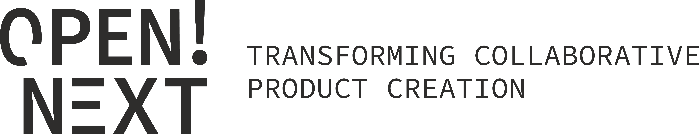

Task 6.1 coordinates project-wide activities towards the realisation of the communication, dissemination and exploitation plan in the [project OpenNext](https://opennext.eu). WP6 coordinates project-wide activities towards the realisation of the communication, dissemination, and exploitation (CDE) plans (see section 2.2.3) with respect to the Data Management Plan (see section 2.2.2) and the ambitious open science policy (see section 2.2.1). It specifies these plans and policies into concrete measures and coordinates the action of all participants towards the realisation of these measures. The work performed in WP6 comprises ongoing supportive tasks running all along the project as well as one-off tasks targeting at specific contents produced in other WPs.

This project is funded by the European Union’s Horizon 2020 programme for research and innovation under grant agreement no. 869984 :european_union: